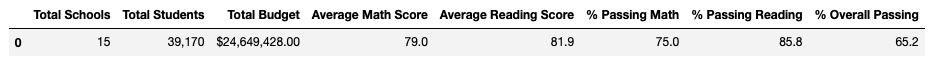
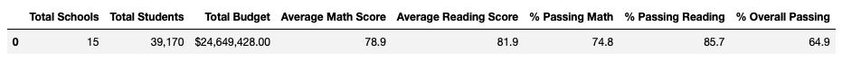
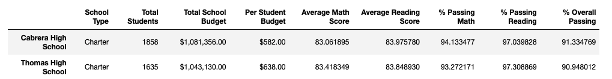
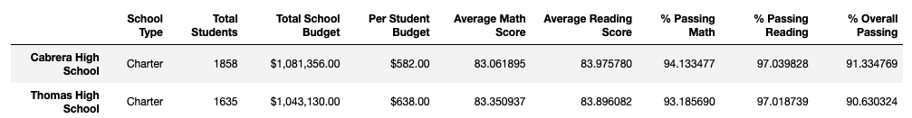
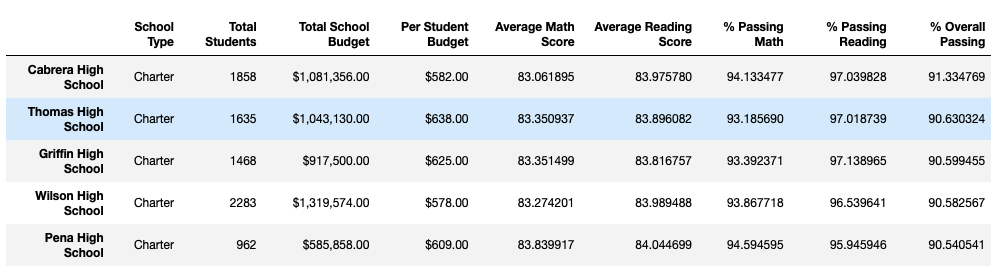
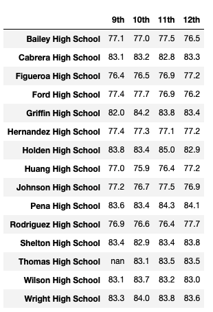
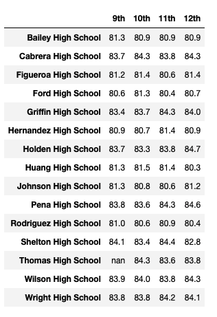
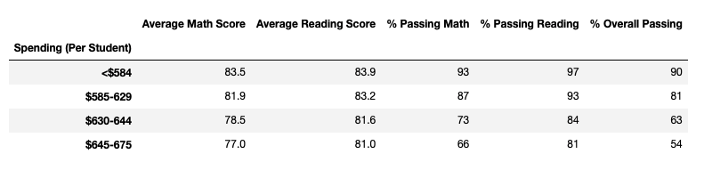
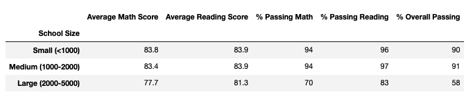
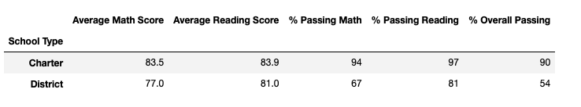

# School_District_Analysis
## Overview of the school district analysis
### Purpose

The school board noticed the evidence of academic dishonesty on the math and reading grade for Thomas High School 9th grader. The purpose of this project is to repeat the school district analysis on Module 4, after replacing the math and reading scores with NaN's for Thomas High School 9th grader and analyze how these changes would affect the overall analysis for the school district. 

## Results
- The district summary shows that there are total 15 schools with 39,170 students and total budget is $24,649,428.00. After replacing the math and reading scores with NaN's for Thomas High School 9th grader, the average math score, the passing math percentage, the passing reading percentage, and the overall passing percentage slightly dropped.
The overall effect is minimal as shown on the table below.

	- Original district summary
	
	- District summary after replacing the math and reading scores with NaNs 
	

- Only the summary for Thomas High School is affected on the per_school_summary_df. As shown on the table below, the average math score, the average reading score, the passing math percentage, the passing reading percentage, and the overall passing percentage are slightly changed after replacing the math and reading scores with NaN's for Thomas High School 9th grader.
	- Original school summary 
	
	- School summary after replacing the math and reading scores with NaNs
	

- As mentioned the above, Thomas High School's performance is slightly changed after replacing the ninth graders' math and reading scores. However since the amount is minimal, it doesn't affect Thomas High School's performance relative to the other schools. Thomas High School still ranks top 2 out of 15 schools.
	- Top 5 schools
	

- How does replacing the ninth-grade scores affect the following:
	- Math and reading scores by grade: Only the math and reading scores for Thomas High School 9th graders have been updated to NaN (Not a Number). 
	
		- Math scores by grade 
		                                      
		        
		
		 - Reading scores by grade
		 
		
	
	- Scores by school spending: Since Thomas High School's spending range is $630-$644, the average math score, the average reading score, the passing math percentage, the passing reading percentage, and the overall passing percentage for the spending range of $630-644 are slightly changed after replacing the ninth graders' math and reading scores. But since the amount is minimal, there is no effect if they are rounded. The summary shows that the average math and reading scores and the passing rates are higher when spending amount per student is lower. 
		- Spending summary
		
		

	- Scores by school size: Since Thomas High School's school size falls under "Medium(1000-2000)", the average math score, the average reading score, the passing math percentage, the passing reading percentage, and the overall passing percentage for medium school size are slightly changed after replacing the ninth-grader scores. But since the amount is minimal, there is no effect if they are rounded. The small to medium schools have higher average math and reading scores and higher passing rates than large schools.
		- Size summary
		
		

	- Scores by school type: Since Thomas High School's school type is "Charter", the average math score, the average reading score, the passing math percentage, the passing reading percentage, and the overall passing percentage for "Charter" are slightly changed. But since the amount is minimal, there is no effect if they are rounded. Charter schools have higher average math and reading scores and higher passing rate. 
		- Type summary
		
		

## Summary
After reading and math score for the ninth grade at Thomas High School have been replaced with NaN's, the average math score for the ditrict drops by 0.1, the passing math percentage for the district drops by 0.2, the passing reading percentage for the district drops by 0.1, and the overall passing percentage for the district drops by 0.3. The changes would not affect the overall analysis for the school district.

